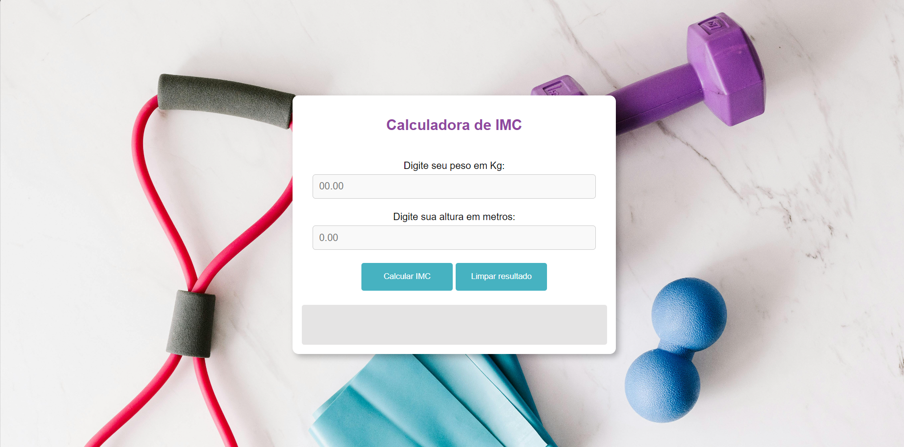

# Calculadora de IMC

Este projeto é uma **Calculadora de Índice de Massa Corporal (IMC)** simples que permite aos usuários calcular seu IMC com base em seu peso e altura. Ele fornece feedback sobre a classificação do IMC com base nos valores fornecidos e inclui uma funcionalidade para limpar os campos e a mensagem de erro.

## Funcionalidades

- **Cálculo de IMC**: Calcula o IMC com base no peso e altura fornecidos pelo usuário.
- **Classificação do IMC**: Exibe a classificação do IMC com base nos seguintes intervalos:
  - Abaixo do peso
  - Peso normal
  - Sobrepeso
  - Obesidade
  - Obesidade Grave
- **Validação de Campos**: Exibe uma mensagem de erro se os campos de peso ou altura estiverem vazios.
- **Limpeza dos Campos**: Permite limpar os campos de entrada e o resultado exibido.

## Tecnologias Utilizadas

- **HTML**: Estrutura da página.
- **CSS**: Estilização da página (incluso no arquivo `style.css`).
- **JavaScript**: Lógica para cálculo do IMC e manipulação do DOM (incluso no arquivo `script.js`).

## Instruções de Uso

### Entrada de Dados

- Digite seu peso em quilogramas no campo "Digite seu peso em Kg".
- Digite sua altura em metros no campo "Digite sua altura em metros".

### Calcular IMC

- Clique no botão "Calcular IMC" para obter o valor do IMC e a classificação correspondente.

### Limpar Resultados

- Clique no botão "Limpar resultado" para limpar os campos de entrada e o resultado exibido.

### Mensagens de Erro

- Se algum dos campos estiver vazio, uma mensagem de erro será exibida solicitando o preenchimento dos campos.

## Exemplo

